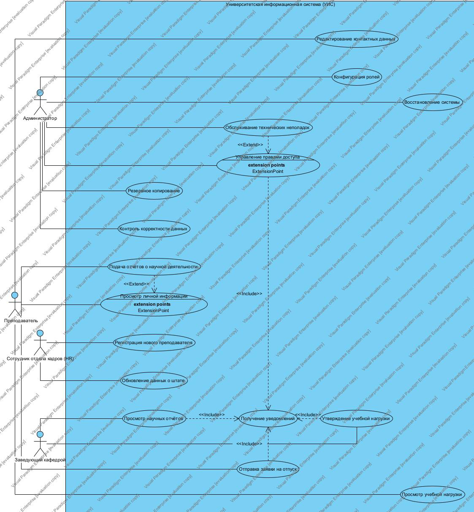
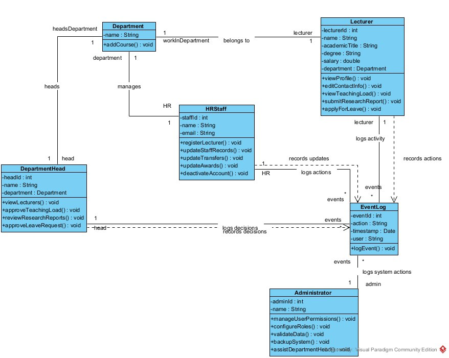
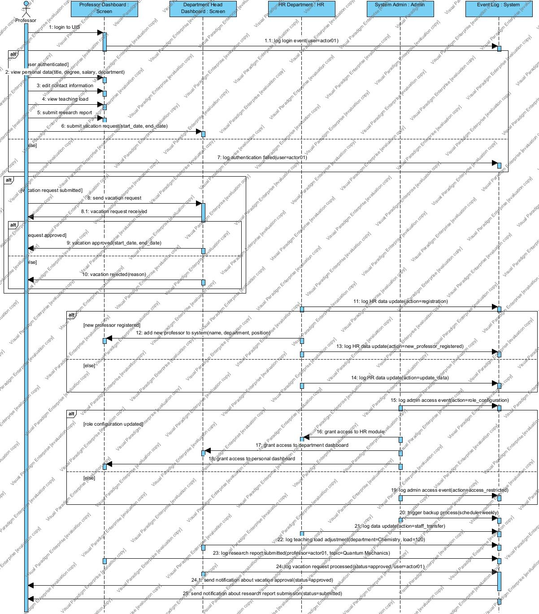
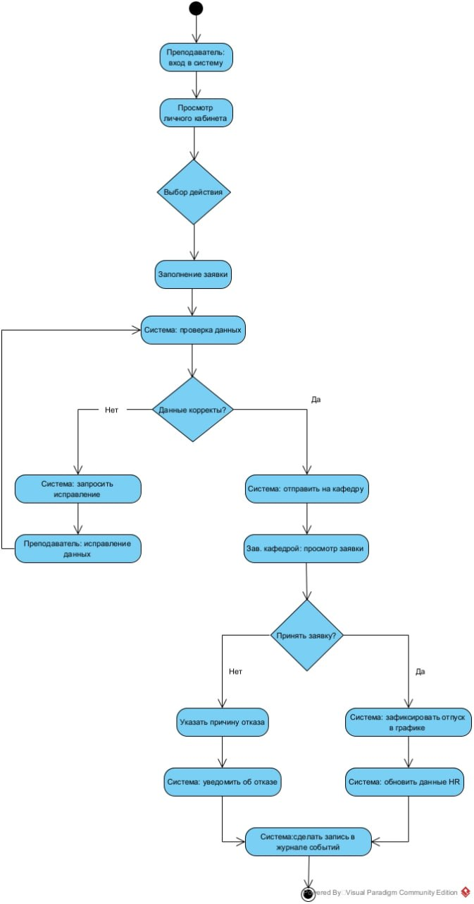
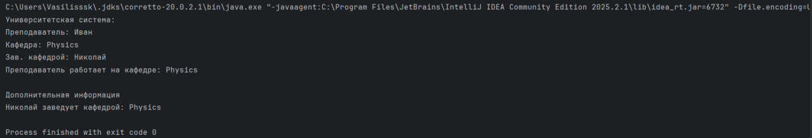

# Университетская инф. система

## Структура
- `src/` - исходный код
- `UnivSistem/uml_diagrams` - UML-диаграммы
- `/UnivSistem/Univ_Sistem.vpp/` - файл модели visual paradigm (.vpp)
- `Screenshots/` - скриншот выполнения

## Описание
Данный проект представляет собой комплексную модель и действующий прототип корпоративной информационной системы, предназначенной для автоматизации рабочих процессов профессорско-преподавательского состава университета.

## UML

### 1. Диаграмма прецендентов

### 2. Диаграмма классов (Forward)

### 3. Диаграмма классов (Reverse)

### 4. Диаграмма последовательностей

### 5. Диаграмма активности

## Результат выполнения программы

